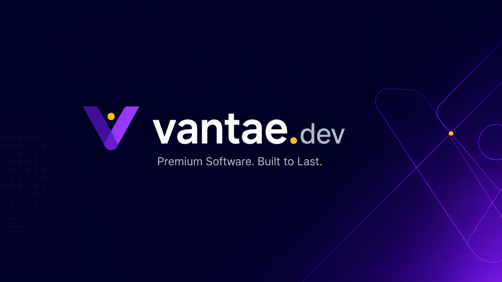
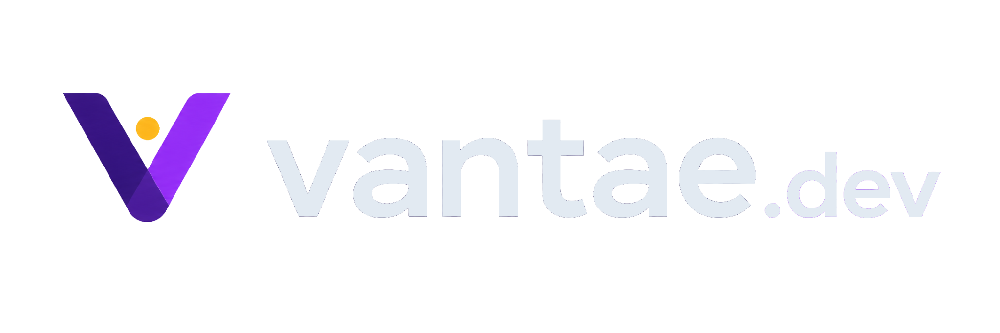
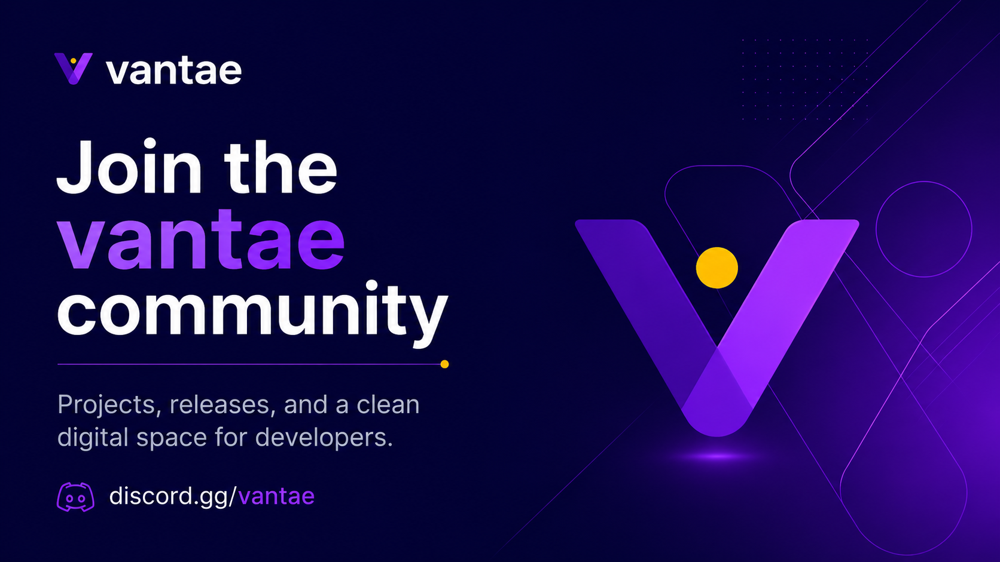
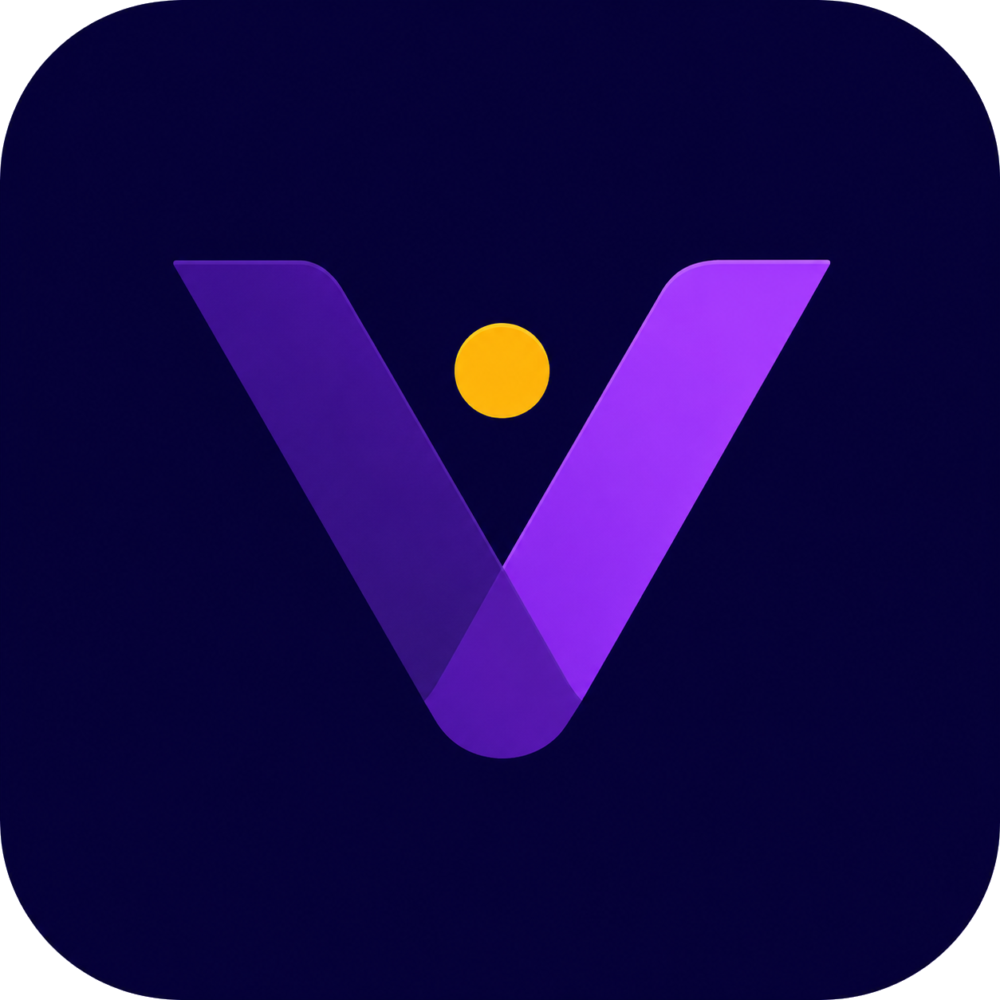

<!--
Suggested folder structure:

.github/
└── profile/
    ├── README.md
    └── assets/
        ├── vantae-banner-main.png
        ├── vantae-logo-wordmark.png
        ├── vantae-icon.png
        └── vantae-community-banner.png
-->

  

  

  <strong>Premium software studio for digital products.</strong>

  Modern tools, polished experiences, and clean execution.

  <a href="https://vantae.dev">Website</a>
  ·
  <a href="https://discord.gg/vantae">Community</a>
  ·
  <a href="https://github.com/vantae-dev">GitHub</a>

---

## About vantae.dev

vantae.dev is a premium software studio focused on building modern digital products, clean user experiences and polished web solutions.

We care about the details that make software feel complete:
- clear structure
- modern UI
- reliable engineering
- scalable architecture
- strong brand presentation

---

## What we build

- SaaS products
- Web applications
- Dashboards and admin panels
- Landing pages and marketing sites
- Internal tools
- Community-focused digital products
- Creator and developer tools

---

## Core principles

### Clean by design
We build products that feel sharp, minimal and intentional.

### Built to last
We focus on maintainable architecture, scalable code and practical solutions.

### Product-minded
Design, engineering and usability should work together — not compete.

---

## Tech stack

Depending on the project, we commonly work with:

- Next.js
- React
- TypeScript
- Node.js
- Tailwind CSS
- MongoDB
- Prisma
- REST APIs
- Auth systems
- Discord integrations

---

## Community

We are also building a space for developers, creators and product-focused people.

  

If you want to follow updates, launches and experiments:

  <a href="https://discord.gg/vantae"><strong>Join the Vantae community</strong></a>

---

## Selected identity assets

  

This organization profile uses a visual system based on:
- deep navy / indigo backgrounds
- purple gradients
- gold accent details
- minimal geometric forms
- clean modern typography

---

  <strong>vantae.dev</strong> 
  Premium software. Built to last.

